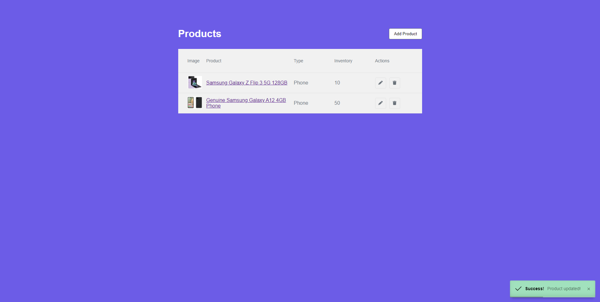
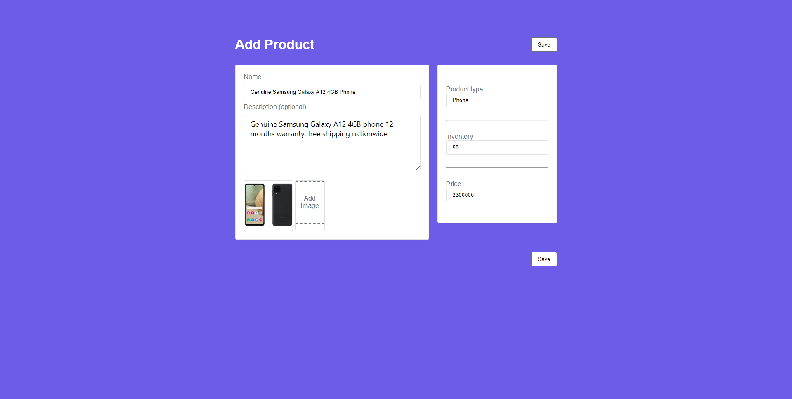
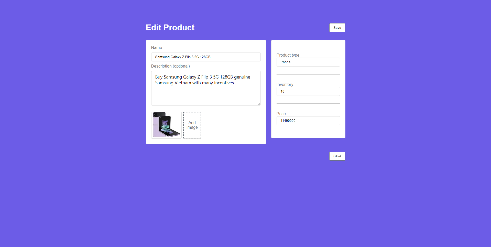

# Laravel CRUD with Laravel and ReactJS
## About Repository
A very simple Laravel 9 + ReactJS 18.2 + Vite 3.0 based **CRUD** Starter template for SPA Application.
## Screenshots

## Installation

- `git clone https://github.com/vu174/crud-products-with-laravel-reactjs`
- `cd crud-products-with-laravel-reactjs/`
- `composer install`
- `cp .env.example .env`
- Update `.env` and set your database credentials
- `php artisan key:generate`
- `php artisan migrate`
- `npm install`
- `npm run dev`
- `php artisan serve`

## License

[MIT license](https://opensource.org/licenses/MIT).